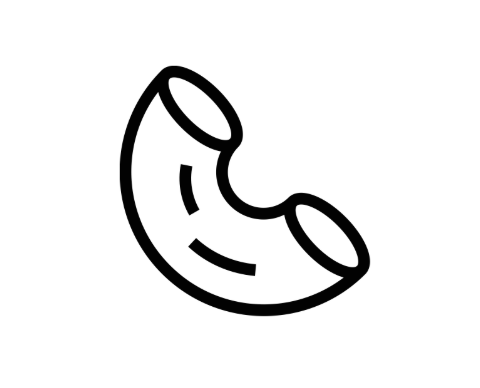
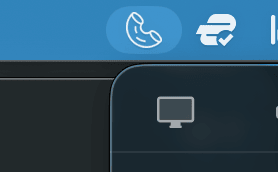
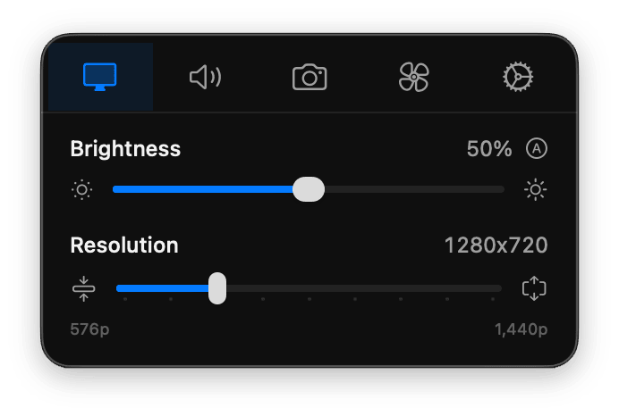
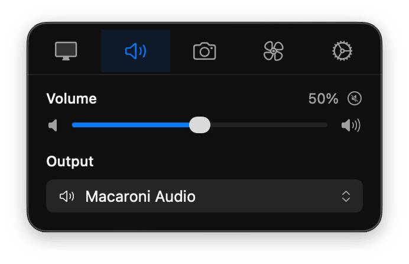
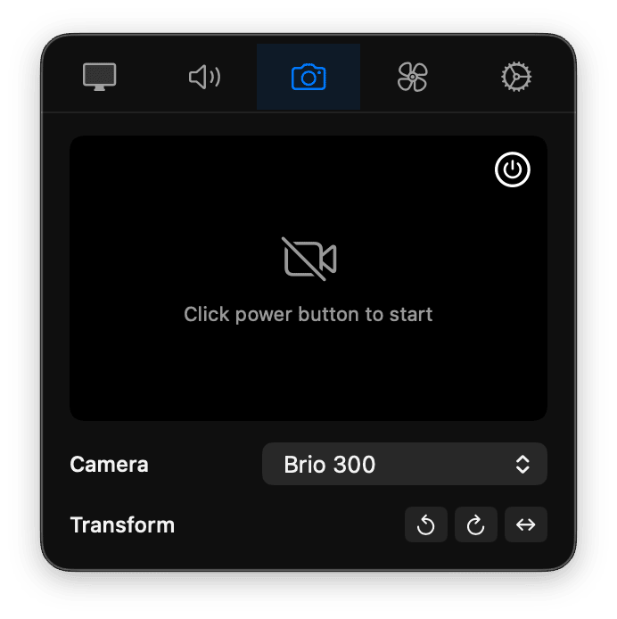
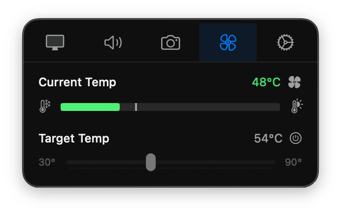
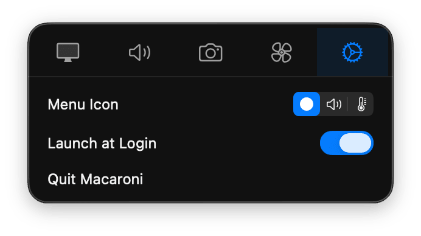

<h1 align="center">
  <br>
  Macaroni
</h1>

<p align="center">
  <strong>All-in-one Mac utility. Cooked al dente.</strong>
</p>

<p align="center">
  
  
  
  
</p>

---

A **free, open-source macOS menubar utility** that combines the functionality of five separate apps into one lightweight, native application:



| Instead of... | You get... |
|---------------|------------|
| **BetterDisplay** ($18) | Crisp text on external monitors, brightness without buttons |
| **SoundSource** ($39) | Unlock volume control on external speakers |
| **Hand Mirror** ($8) | Quick camera check before video calls |
| **OBS Virtual Camera** | Transform your camera feed—rotate, flip, mirror |
| **Mac Fan Control** | Custom fan curves to prevent thermal throttling |

**One simple app. Just the features you need, none of the bloat. Free and open source.**

---

## Features

### 🖥️ Display Control



Control your external monitor's brightness with a slider or keyboard shortcut — no more reaching behind the display to fumble with tiny buttons. Text looks crisp and sharp thanks to HiDPI scaling that fixes the blurry mess macOS gives most external monitors out of the box.

- Brightness slider with keyboard shortcuts (`Ctrl+=` / `Ctrl+-`)
- **Auto brightness** — uses your location to follow sunrise and sunset, dimming at night and brightening during the day, hands-free
- Crisp HiDPI scaling for sharp text on external displays
- Resolution scaling with `Ctrl+Shift+=` / `Ctrl+Shift+-` — you know how you zoom in and out of a browser? Now you can do the same thing for your Mac's entire display

<br clear="right"/>

---

### 🔊 Audio Control



Monitor speakers over HDMI or DisplayPort ignore your Mac's volume keys. Macaroni gives you a volume slider that works with any audio device — even ones macOS normally won't let you control.

- Volume slider for any output device, including stubborn HDMI/DP speakers
- Quick device switching between outputs
- Dynamic menubar icon that reflects current volume level
- Mute toggle

<br clear="right"/>

---

### 📷 Camera Preview & Virtual Camera



One click in your menubar shows a live camera preview — quick hair check before a call, no Photo Booth required. Macaroni also creates a virtual camera that Zoom, Meet, FaceTime, and any other app can see, with rotation and flip built in.

- Instant camera preview from the menubar
- Virtual camera output visible to all video apps
- Rotate and flip your camera feed on the fly

<br clear="right"/>

---

### 🌡️ Fan Control



macOS prioritizes silence over cooling. Macaroni lets you set a custom fan curve so your Mac stays cool during heavy workloads instead of thermal throttling in silence.

- Real-time CPU temperature in your menubar
- Custom fan curves with configurable trigger temperature
- Manual RPM override via slider
- Full M1/M2/M3/M4 support

<br clear="right"/>

---

### ⚙️ Customization



Choose what lives in your menubar — the Macaroni icon, a dynamic volume indicator, or the current CPU temperature. Launch at login with one click.

Everything important is one shortcut away — no menus, no clicking:

| Action | Shortcut |
|--------|----------|
| Brightness up | `Ctrl` + `=` |
| Brightness down | `Ctrl` + `-` |
| Scale up (bigger) | `Ctrl` + `Shift` + `=` |
| Scale down (smaller) | `Ctrl` + `Shift` + `-` |

All shortcuts are customizable.

<br clear="right"/>

---

## Installation

### Requirements

- macOS 14 Sonoma or later
- Apple Silicon Mac (M1/M2/M3/M4) for fan control
- Most external monitors support brightness control (works over HDMI, DisplayPort, USB-C)

### Build from Source

```bash
# Clone the repository
git clone https://github.com/awanishraj/macaroni.git
cd macaroni

# Install XcodeGen if needed
brew install xcodegen

# Generate Xcode project
xcodegen generate

# Build and run
make run
```

### Virtual Camera Setup

The virtual camera requires approving a system extension:

1. Run Macaroni
2. Go to Camera tab → Click "Activate" on Virtual Camera
3. Approve in System Settings → Privacy & Security → Extensions
4. Restart Macaroni when prompted

### Fan Control Setup

Fan control requires installing a privileged helper:

1. Go to Fan tab
2. Click "Install Helper"
3. Enter your password when prompted
4. The helper runs as a LaunchDaemon with minimal privileges

<details>
<summary><strong>Architecture</strong></summary>

```
Macaroni.app
├── Main App (SwiftUI)
│   ├── Display   → DDCService, SolarBrightnessService, VirtualDisplayService
│   ├── Audio     → AudioManager (SimplyCoreAudio)
│   ├── Camera    → CameraManager, FrameProcessor, CMIOSinkSender
│   └── Fan       → ThermalService, FanCurveController
│
├── MacaroniFanHelper (Privileged XPC Service)
│   └── SMC read/write for fan control
│
└── MacaroniCameraExtension (CMIOExtension)
    └── Virtual camera with sink/source streams
```

</details>

<details>
<summary><strong>How It Works</strong></summary>

**Display Brightness** — Communicates directly with your monitor's hardware using the DDC/CI protocol (the same way your monitor's own buttons work). This means real brightness adjustment—not a software overlay that washes out colors.

**Virtual Camera** — Creates a system-level virtual camera that appears in any app's camera selection. Macaroni captures your real camera, applies your chosen transforms, and outputs the result as "Macaroni Camera".

**Fan Control** — Uses a privileged helper to communicate directly with your Mac's fan controller. You can set custom temperature triggers or manually control fan speed when you need extra cooling.

**Temperature Reading** — Reads your Mac's thermal sensors and reports the CPU temperature in real-time. Works on all Apple Silicon Macs (M1 through M4).

</details>

## Dependencies

| Package | Purpose |
|---------|---------|
| [KeyboardShortcuts](https://github.com/sindresorhus/KeyboardShortcuts) | Global hotkey handling |
| [SimplyCoreAudio](https://github.com/rnine/SimplyCoreAudio) | CoreAudio device management |
| [Solar](https://github.com/ceeK/Solar) | Sunrise/sunset calculation |
| [LaunchAtLogin](https://github.com/sindresorhus/LaunchAtLogin-Modern) | Login item management |

---

## Acknowledgments

Macaroni was built by studying and learning from these excellent open-source projects:

- [MonitorControl](https://github.com/MonitorControl/MonitorControl) - Display brightness control
- [BetterDisplay](https://github.com/waydabber/BetterDisplay) - HiDPI scaling
- [OBS Studio](https://github.com/obsproject/obs-studio) - Virtual camera architecture
- [Stats](https://github.com/exelban/stats) - Temperature and fan monitoring

<details>
<summary><strong>SIP Configuration (Apple Silicon)</strong></summary>

Some features require reduced System Integrity Protection. This is a one-time setup.

**Part A: Recovery Mode**

1. **Shut down** your Mac completely (Apple menu → Shut Down)
2. **Enter Recovery Mode**: Press and hold Power button until "Loading startup options" appears
3. **Open Startup Security Utility**: Click Options → Continue → Utilities menu → Startup Security Utility
4. **Set Reduced Security**:
   - Select your startup disk
   - Click "Security Policy..."
   - Select "Reduced Security"
   - Check "Allow user management of kernel extensions from identified developers"
   - Click OK and authenticate
5. **Open Terminal**: Utilities menu → Terminal
6. **Run**:
   ```bash
   csrutil enable --without kext --without debug
   ```
7. **Restart**: Type `reboot` and press Enter

**Part B: After Reboot**

8. Open Terminal (Applications → Utilities → Terminal)
9. Enable system extension developer mode:
   ```bash
   systemextensionsctl developer on
   ```
10. Verify with `csrutil status` — should show "enabled" with kext and debug exceptions

</details>

## License

MIT License - see [LICENSE](LICENSE) for details.

---

<p align="center">
  <sub>Made with ❤️ for Mac users who want fewer menubar icons</sub>
</p>
